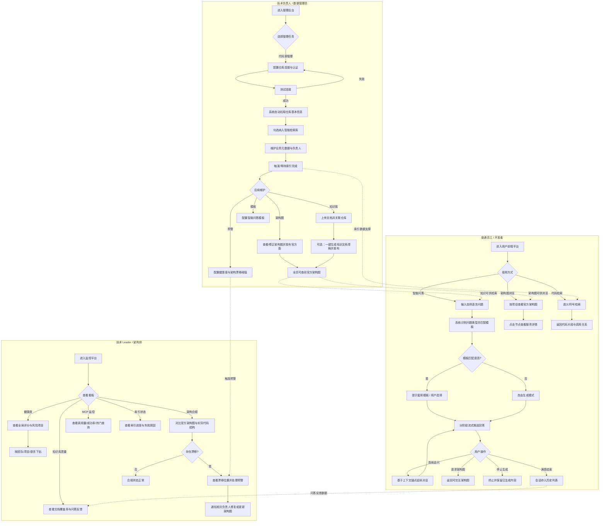

# 灵镜（LingPrism）企业知识与代码智能平台
## 业务需求规格说明书（PRD）

| 属性 | 内容 |
|------|------|
| 产品名称 | 灵镜（LingPrism） |
| 产品代号 | Prism（棱镜墨斯） |
| 文档版本 | v1.0 |
| 文档状态 | 初稿 |
| 适用对象 | 公司领导层、产品团队、开发团队、架构师、运维团队 |
| 文档性质 | 业务需求规格说明（不含技术选型与实现设计） |

---

## 1. 文档修订记录与术语定义

### 1.1 文档修订记录

| 版本 | 日期 | 修订人 | 修订说明 |
|------|------|--------|----------|
| v1.0 | 2026-07-06 | 产品业务分析 | 初版发布，覆盖管理后台、用户前端平台、监控平台三大模块核心业务需求 |

### 1.2 术语定义

| 术语 | 定义 |
|------|------|
| **灵镜（LingPrism）** | 本产品的正式名称，企业级代码与知识智能平台 |
| **代码源** | 企业内可被平台接入、拉取与分析的代码仓库，通常以 Git 地址标识 |
| **纳管仓库** | 经管理员勾选并纳入智能检索库的代码仓库，其代码与元数据参与问答、图谱与监控 |
| **知识库** | 平台内存储的团队知识文档集合，包括设计文档、架构决策记录（ADR）、运维手册、培训文档等 |
| **代码知识图谱** | 系统基于代码分析自动构建的结构化关系网络，涵盖模块依赖、服务调用链、符号定义与引用关系等 |
| **架构图** | 以可视化方式呈现系统/服务/模块之间关系的图形，可由系统自动生成并经管理员修正后发布 |
| **官方架构图** | 经管理员审核并"发布为官方版本"的架构图，作为全员查阅与架构合规性对比的基准 |
| **架构漂移** | 实际代码中的依赖或调用关系与官方架构图声明不一致的情况 |
| **智能问答模板** | 管理员预置的问答输出格式规则，用于将特定类型问题的回答结构化为统一格式 |
| **上下文锚点** | 当前会话中系统识别的讨论焦点（如某个服务、模块、文档），用于支撑连续追问的精准定位 |
| **健康度评分** | 综合代码复杂度、重复率、循环依赖、测试覆盖率等指标计算的项目健康状况量化分值 |
| **MCP 服务** | 平台对外暴露的标准化能力接口，供外部 AI Agent（如 Cursor、Claude Code）调用平台知识与检索能力 |
| **索引** | 系统对代码仓库进行解析、结构化存储并纳入检索体系的处理过程 |
| **增量更新** | 因代码仓库发生变更而触发的局部重新索引与知识刷新 |
| **流式推送** | 系统回答以逐字/逐段实时呈现给用户的交互方式，而非一次性返回完整结果 |
| **语义检索** | 基于自然语言含义匹配相关代码片段的检索方式，不要求用户输入精确关键词 |
| **符号检索** | 基于函数名、类名等代码符号精确定位的检索方式 |

### 1.3 文档范围与边界

**本文档包含：**

- 用户角色与权限边界
- 三大业务模块的功能性需求（输入、处理规则、输出）
- 界面交互规则与业务流程
- 业务层面的非功能性需求
- 核心验收用例

**本文档不包含：**

- 技术选型、架构设计、接口协议定义
- 数据库表结构、存储方案
- 具体算法、代码实现逻辑
- 部署方案与运维脚本

---

## 2. 用户角色定义

### 2.1 角色总览

| 角色 | 典型用户 | 核心诉求 | 主要使用模块 |
|------|----------|----------|--------------|
| **普通员工 / 开发者** | 一线研发、测试、产品、运维工程师 | 快速理解项目架构与业务逻辑，自然语言提问获取答案，浏览架构图与代码 | 用户前端平台 |
| **技术负责人 / 数据管理员** | 团队 Tech Lead、平台管理员、知识库维护人 | 接入与管理代码源，维护项目元数据与知识库，配置模板与预警规则，发布官方架构图 | 管理后台 |
| **技术 Leader / 架构师** | 部门技术总监、企业架构师、SRE 负责人 | 全局俯瞰项目健康度、架构合规性、知识库质量及平台运行状态 | 监控平台、管理后台（只读/配置类） |
| **公司领导层** | CTO、研发 VP、业务负责人 | 掌握整体研发资产健康状况、风险项目与知识沉淀情况 | 监控平台（看板只读） |

### 2.2 角色权限边界（业务层面）

| 能力域 | 普通员工/开发者 | 技术负责人/管理员 | 技术Leader/架构师 | 公司领导层 |
|--------|----------------|-------------------|-------------------|------------|
| 智能问答与对话 | ✅ 全部 | ✅ 全部 | ✅ 全部 | ✅ 只读（可提问，不可管理） |
| 架构图浏览 | ✅ 查看已发布官方版 | ✅ 查看 + 编辑 + 发布 | ✅ 查看 + 审核建议 | ✅ 只读 |
| 代码源接入与配置 | ❌ | ✅ | ✅ 审批/监督 | ❌ |
| 项目元数据维护 | ❌ | ✅ | ✅ 只读 + 建议 | ❌ |
| 知识库文档管理 | ❌ 只读已发布文档 | ✅ 上传/编辑/发布 | ✅ 审核 | ❌ |
| 模板与预警配置 | ❌ | ✅ | ✅ 共同制定规则 | ❌ |
| 监控看板 | ❌ 或仅本团队只读 | ✅ 本团队范围 | ✅ 全局 | ✅ 全局只读 |
| MCP 服务调用监控 | ❌ | ✅ | ✅ | ✅ 只读 |
| 历史会话管理 | ✅ 仅个人会话 | ✅ 仅个人会话 | ✅ 仅个人会话 | ✅ 仅个人会话 |

### 2.3 角色使用场景摘要

**普通员工 / 开发者：**

- 入职后通过自然语言提问了解"支付服务核心流程是什么"
- 在对话中请求生成某服务的架构图并点击节点查看详情
- 通过语义检索定位"处理订单状态回滚"的相关代码

**技术负责人 / 数据管理员：**

- 配置公司 Git 仓库连接并测试连通性
- 为 `payment-service` 设置业务中文名"支付中台服务"并指定负责人
- 上传 ADR 文档并关联到对应仓库，一键生成培训文档草稿后发布
- 修正系统自动生成的架构图并发布为官方版本

**技术 Leader / 架构师：**

- 在健康度看板发现评分低于阈值的风险项目并下钻查看
- 在架构合规性看板处理架构漂移预警
- 查看 MCP 服务调用趋势，识别异常波动

---

## 3. 业务总体流程图

以下流程图描述三类核心角色从"发起操作/提问"到"获得结果"的完整业务路径。

---

## 4. 功能性需求详细说明

### 4.1 模块一：管理后台

> **面向角色：** 技术负责人、数据管理员  
> **模块目标：** 完成代码源接入、知识资产维护、架构图治理、模板与预警配置，为前台问答与监控提供可信数据基础。

---

#### 4.1.1 代码源管理

**功能描述：** 管理员在页面上配置企业代码仓库连接，验证连通性，并由系统自动采集仓库基本信息展示于列表。

| 维度 | 说明 |
|------|------|
| **输入条件** | ① 管理员已登录管理后台且具有代码源管理权限；② 用户填写仓库地址（Git 地址）；③ 用户选择认证方式（SSH / HTTPS）；④ 用户配置分支策略（如默认分支、需同步的分支范围）；⑤ 用户提交保存或测试连接请求 |
| **处理规则** | ① 保存前须校验必填项完整性（地址、认证方式、分支策略）；② 用户点击"测试连接"时，系统即时验证认证凭据与仓库可达性，不保存也可测试；③ 测试成功后方允许正式保存并纳入待同步列表；④ 连接成功后，系统自动拉取仓库基本信息，包括：仓库描述、编程语言分布、最近提交记录摘要；⑤ 拉取失败时，列表中标注失败状态并展示可读的错误原因（如认证失败、仓库不存在、网络不可达）；⑥ 支持对已配置仓库进行编辑、禁用、重新测试连接；⑦ 禁用状态的仓库不参与后续索引与检索 |
| **输出结果** | ① 测试连接：即时反馈"成功"或"失败 + 原因说明"；② 列表页展示所有已配置仓库，每行包含：仓库地址、连接状态、语言分布概览、最近提交时间、同步/索引状态；③ 保存成功后给出明确操作成功提示 |

**界面交互规则：**

- 认证方式为 SSH 时，展示密钥配置区域；为 HTTPS 时，展示用户名/令牌配置区域
- "测试连接"按钮在必填项未填完时置灰不可点击
- 列表支持按连接状态、语言、最近更新时间筛选与排序

---

#### 4.1.2 项目元数据维护

**功能描述：** 管理员从已连接仓库中勾选纳入智能检索库的仓库，并维护业务侧元数据与负责人信息。

| 维度 | 说明 |
|------|------|
| **输入条件** | ① 目标仓库已成功连接；② 管理员勾选/取消"纳入智能检索库"；③ 管理员编辑业务中文名、业务标签、业务负责人、技术负责人 |
| **处理规则** | ① 仅已连接且未被禁用的仓库可被勾选纳入；② 勾选纳入后，系统将该仓库加入索引队列；③ 取消勾选后，仓库代码不再参与智能问答与语义检索，但历史数据保留，状态标记为"已移出检索库"；④ 业务中文名默认为仓库名，管理员可覆盖，长度限制 2~50 字符；⑤ 业务标签支持多选/自由输入，用于后续问答路由与筛选，同一仓库标签不可重复；⑥ 负责人从企业人员目录中选择，每人须关联姓名与所属团队；⑦ 元数据变更即时生效，已发布架构图与文档中的负责人信息同步更新；⑧ 业务中文名与标签变更记录操作日志 |
| **输出结果** | ① 列表展示所有仓库的纳管状态（已纳入 / 未纳入 / 已移出）；② 展示并支持编辑业务中文名、标签、负责人；③ 勾选变更后提示"已加入索引队列"或"已移出检索库"；④ 保存元数据后展示更新成功确认 |

**界面交互规则：**

- 列表提供批量勾选纳入/移出能力，批量操作前须二次确认
- 业务标签以标签云/多选下拉形式展示，支持搜索已有标签
- 负责人字段支持按姓名/团队搜索选人

---

#### 4.1.3 知识库管理

**功能描述：** 管理员上传维护团队知识文档，关联代码仓库或模块，并支持一键生成培训文档草稿。

| 维度 | 说明 |
|------|------|
| **输入条件** | ① 管理员上传文档（支持常见办公与文本格式）或在线创建文档；② 管理员指定文档类型（设计文档 / ADR / 运维手册 / 培训文档 / 其他）；③ 管理员关联目标仓库或模块；④ 管理员发起"一键生成培训文档"并指定目标仓库或模块 |
| **处理规则** | ① 上传文档须填写标题、类型，类型为必填；② 同一文档可关联多个仓库或模块，关联关系可后续修改；③ 文档有"草稿"与"已发布"两种状态，仅已发布文档对员工可见且参与问答检索；④ 删除文档须二次确认，已发布文档删除后从检索库移除但保留审计记录；⑤ 一键生成培训文档时，系统自动从目标仓库/模块提取：项目结构概览、核心功能说明、接口清单摘要、数据实体关系摘要，组装为结构化培训文档草稿；⑥ 草稿生成后进入可编辑状态，不自动发布，须管理员审阅编辑后手动发布；⑦ 文档更新后，关联的问答知识源在下次检索时优先使用最新版本 |
| **输出结果** | ① 知识库列表展示所有文档：标题、类型、关联仓库/模块、状态、更新时间、创建人；② 上传/保存成功提示；③ 一键生成完成后展示草稿预览，并提示"请审阅后发布"；④ 发布成功后文档状态变更为"已发布" |

**界面交互规则：**

- 文档列表支持按类型、关联仓库、状态、更新时间筛选
- 一键生成培训文档入口位于仓库详情页与知识库管理页
- 草稿编辑器支持分段结构（概述、功能模块、接口说明、数据关系、注意事项等）的折叠与编辑

---

#### 4.1.4 架构图与关系图管理

**功能描述：** 管理员查看系统自动生成的架构图，手动修正后发布为官方版本，并管理架构图展示模板。

| 维度 | 说明 |
|------|------|
| **输入条件** | ① 目标仓库已完成索引；② 管理员进入架构图管理页选择仓库/系统；③ 管理员对架构图进行手动编辑（增删节点、调整连线、修改标注）；④ 管理员执行"发布为官方版本"操作；⑤ 管理员创建/编辑架构图模板 |
| **处理规则** | ① 系统在仓库索引完成后自动生成初版架构图，包括：模块依赖关系、服务调用链、数据实体关系；② 自动生成版本标记为"系统草稿"，非官方版本，员工不可见；③ 管理员可基于系统草稿创建编辑副本，编辑操作记录变更历史；④ 发布为官方版本时，须填写版本说明（如"2026-Q2 架构"），系统保留历史官方版本供回溯；⑤ 同一仓库同时仅有一个"当前官方版本"，发布新版本后旧版归档；⑥ 架构图模板定义不同项目类型（如微服务、单体应用、数据平台）使用的展示结构（如分层架构、C4 模型），管理员可为仓库指定适用模板；⑦ 模板变更不影响已发布官方版，仅影响下次自动生成草稿的呈现结构 |
| **输出结果** | ① 展示系统草稿版与当前官方版架构图，可切换查看；② 编辑后保存为管理员修订版；③ 发布成功后提示"已发布为官方版本 vX"，全员可在前端浏览；④ 模板列表展示模板名称、适用项目类型、节点层级定义 |

**界面交互规则：**

- 架构图编辑器支持拖拽节点、添加注释、删除/新增连线
- 发布前展示与上一官方版本的差异摘要（新增/删除/变更的节点与关系）
- 未保存编辑内容时离开页面须提示确认

---

#### 4.1.5 模板管理（文档/问答模板）

**功能描述：** 管理员维护智能问答模板，定义特定问题类型的标准化输出格式。

| 维度 | 说明 |
|------|------|
| **输入条件** | ① 管理员创建/编辑/删除问答模板；② 模板包含：模板名称、触发问题类型或匹配关键词、输出格式结构、适用角色（可选）；③ 示例：当用户问"XX 服务的功能是什么"时，按"服务名称 → 业务职责 → 核心接口 → 依赖的下游服务 → 负责人"格式输出 |
| **处理规则** | ① 模板名称不可与已有模板重复；② 每个模板至少定义一种触发条件（问题类型标签或关键词组合）；③ 输出格式以结构化字段列表定义，字段可设定为必填或可选；④ 模板状态分为"启用"与"停用"，停用模板不参与前台匹配；⑤ 模板支持设置优先级，多个模板同时匹配时取优先级最高者；⑥ 模板变更即时生效，不影响历史已生成回答；⑦ 删除模板须二次确认 |
| **输出结果** | ① 模板列表展示：名称、触发条件摘要、输出格式摘要、状态、优先级、更新时间；② 创建/更新/删除操作成功提示；③ 模板详情页支持预览示例输出效果 |

**界面交互规则：**

- 提供模板预览功能：输入示例问题，展示按模板格式化后的模拟输出
- 触发条件配置支持"问题类型"下拉（架构类/代码类/文档类/人员类）与关键词组合

---

#### 4.1.6 监控与预警配置

**功能描述：** 管理员配置代码健康度与架构漂移的预警规则与通知方式。

| 维度 | 说明 |
|------|------|
| **输入条件** | ① 管理员配置健康度预警阈值（如循环依赖数上限 N、单文件行数上限 M、健康度评分下限等）；② 管理员配置架构漂移预警开关及通知对象；③ 管理员指定通知渠道（站内消息、邮件等，按企业集成情况） |
| **处理规则** | ① 阈值支持全局默认与按团队/项目覆盖，项目级配置优先于全局；② 健康度指标每次索引更新后重新计算，超阈值时生成预警事件；③ 架构漂移检测在索引完成后自动对比官方架构图与实际代码结构，发现不一致时生成漂移记录；④ 同一项目同一类型预警在未处理前不重复发送，避免告警风暴；⑤ 预警事件须记录：触发时间、项目、具体指标值、阈值、建议处理动作；⑥ 管理员可将预警标记为"已处理"或"已忽略"，并填写处理备注 |
| **输出结果** | ① 配置页展示当前所有阈值与预警规则；② 保存成功后提示生效范围（全局/指定团队/项目）；③ 预警事件在监控平台看板与管理员通知中心可见 |

**界面交互规则：**

- 阈值输入须校验为合理正整数/百分比范围
- 配置变更记录操作人与时间，支持回滚到上一版本配置

---

### 4.2 模块二：用户前端平台

> **面向角色：** 普通员工、开发者  
> **模块目标：** 以自然语言交互为核心，让员工高效获取项目知识、浏览架构、检索代码，并支持连续对话与历史回顾。

---

#### 4.2.1 智能问答主界面

**功能描述：** 用户通过对话框以自然语言提问，系统识别问题类型并路由到合适知识来源生成回答。

| 维度 | 说明 |
|------|------|
| **输入条件** | ① 用户已登录前端平台；② 用户在对话框输入自然语言问题（如"支付服务的核心流程是什么？""订单表有哪些字段？""用户服务和订单服务之间有调用关系吗？"）；③ 用户点击发送 |
| **处理规则** | ① 系统对用户问题进行意图识别，分类为：架构类、代码类、文档类、人员类，允许多标签；② 根据问题类型路由到对应知识来源：架构类 → 架构图与依赖关系知识；代码类 → 代码图谱与符号索引；文档类 → 知识库文档；人员类 → 项目元数据与负责人信息；③ 若问题无法明确分类，系统综合多源检索后生成回答，并在回答中说明信息来源；④ 系统回答须引用可追溯的信息来源（如关联文档标题、仓库名、架构图节点）；⑤ 对于无法回答或信息不足的问题，明确告知用户原因并给出建议（如"该仓库尚未纳入检索库，请联系管理员"） |
| **输出结果** | ① 对话区展示用户问题气泡与系统回答气泡；② 回答内容按问题类型组织，含可追溯来源标注；③ 无法回答时展示友好提示与建议操作 |

**界面交互规则：**

- 对话框为主要交互入口，页面加载后焦点默认在输入框
- 回答中的来源标注可点击跳转至对应文档/架构图节点/代码位置

---

#### 4.2.2 模板推荐与快捷套用

**功能描述：** 用户提问时，系统异步匹配已有问答模板，高匹配度时提示用户选择套用标准格式或自由生成。

| 维度 | 说明 |
|------|------|
| **输入条件** | ① 用户已输入问题并触发发送；② 系统中存在已启用的问答模板 |
| **处理规则** | ① 用户发送问题后，系统在后台异步匹配模板，匹配与回答生成并行进行；② 匹配度达到阈值（高匹配）时，在对话框上方以卡片形式提示："检测到相似问题模板，是否按标准格式查看？"；③ 卡片展示模板名称与输出格式预览摘要；④ 用户点击"套用"：系统按模板定义的结构化字段重新组织回答，已生成的自由回答可被替换；⑤ 用户点击"忽略"：继续展示自由生成模式的回答，本次会话不再重复提示同一模板；⑥ 匹配度未达阈值时不展示提示卡片，直接走自由生成；⑦ 从提示到用户点击的有效期为当前回答生成周期内，回答完成后卡片自动收起 |
| **输出结果** | ① 高匹配时展示模板推荐卡片（含套用/忽略按钮）；② 套用后回答按模板分段结构化展示；③ 忽略后展示自由生成回答 |

**界面交互规则：**

- 模板推荐卡片位于最新用户问题气泡上方，不遮挡输入框
- 卡片支持关闭（等同忽略）

---

#### 4.2.3 流式交互与打断

**功能描述：** 系统回答以流式方式逐字推送，分阶段展示处理状态，并支持用户中途停止生成。

| 维度 | 说明 |
|------|------|
| **输入条件** | ① 用户已发送问题；② 系统进入回答生成流程；③ 用户在生成过程中点击"停止生成" |
| **处理规则** | ① 回答必须以流式方式推送，逐字/逐段呈现，不得等待全部生成完毕后一次性展示；② 推送过程中分阶段展示状态提示，至少包含："正在理解问题…" → "正在检索代码图谱…" → "正在生成回答…" → "正在整理文档…"（按实际处理阶段显示，跳过不适用阶段）；③ 阶段切换时状态文案更新，已完成阶段可折叠；④ 回答生成过程中，发送按钮变为"停止生成"按钮；⑤ 用户点击"停止生成"后，系统立即终止后续生成，响应时间不超过 2 秒；⑥ 已生成内容完整保留在对话气泡中，末尾标记"已中断"标签；⑦ 中断后用户可继续追问或重新提问 |
| **输出结果** | ① 对话气泡内实时增长的流式文本；② 阶段性状态提示文案；③ 中断后保留的内容 + "已中断"标记；④ 按钮状态随生成状态切换（发送 ↔ 停止生成） |

**界面交互规则：**

- 流式输出时对话区自动滚动至最新内容，用户手动上滚时暂停自动滚动
- "已中断"标签以弱提示样式展示于回答末尾

---

#### 4.2.4 对话上下文与连续追问

**功能描述：** 支持用户在历史对话下追加条件式追问，系统基于会话上下文锚点精准定位回答范围。

| 维度 | 说明 |
|------|------|
| **输入条件** | ① 当前会话中已有至少一轮问答；② 用户输入追问（如"那它的下游依赖有哪些？""这个表的索引字段是什么？"）；③ 追问可能包含指代词（它、这个、该服务） |
| **处理规则** | ① 系统维护当前会话的上下文锚点，记录当前讨论焦点（如服务名、模块名、表名、文档名）；② 每轮回答后根据问题与回答内容更新锚点；③ 用户追问时，系统结合锚点解析指代关系，将追问关联到上一轮讨论对象；④ 若追问对象歧义（可能指向多个服务/模块），系统列出候选并请求用户确认后再回答；⑤ 上下文窗口覆盖当前会话内所有历史轮次，超出容量时保留最近 N 轮及锚点信息；⑥ 用户显式切换话题（如"换个问题，订单服务呢？"）时，系统更新锚点为新对象 |
| **输出结果** | ① 追问回答精准指向锚定对象，无需用户重复提及全名；② 歧义时展示候选确认交互；③ 会话内对话脉络连贯，追问与首轮问题形成逻辑关联 |

**界面交互规则：**

- 追问输入方式与首轮相同，均在底部输入框完成
- 歧义确认以对话内嵌选项卡片呈现，用户点选后继续生成

---

#### 4.2.5 架构图与关系图浏览

**功能描述：** 用户可在对话中请求架构图，也可独立进入架构图浏览模式查看官方发布的架构图，并交互式探索节点详情。

| 维度 | 说明 |
|------|------|
| **输入条件** | ① 对话中：用户提问包含架构图请求（如"画一下支付服务的架构图"）；② 独立浏览：用户进入"架构图浏览"模式，按项目/系统筛选；③ 用户点击架构图中某个节点 |
| **处理规则** | ① 对话中识别架构图请求意图后，返回该服务/系统的官方架构图（若不存在官方版，提示"暂无官方架构图，请联系管理员"）；② 架构图支持交互操作：缩放、拖拽平移、点击节点；③ 点击节点后展示详情侧栏/弹层，包含：服务业务中文名、业务/技术负责人、技术栈概览、最近变更摘要、关联文档链接；④ 独立浏览模式展示所有已发布官方架构图的项目列表，支持按名称/团队筛选；⑤ 非官方版（系统草稿）对员工不可见 |
| **输出结果** | ① 对话内嵌或可展开的交互式架构图；② 独立浏览页的架构图列表与详情；③ 节点详情侧栏信息 |

**界面交互规则：**

- 架构图默认适配视口大小，提供缩放控件与"适应画布"按钮
- 节点 hover 时展示简要名称，click 打开详情
- 对话内架构图支持全屏展开

---

#### 4.2.6 历史会话管理

**功能描述：** 用户通过左侧边栏管理历史对话，支持重命名、删除、收藏与标记重要。

| 维度 | 说明 |
|------|------|
| **输入条件** | ① 用户已有历史会话记录；② 用户对某会话执行重命名、删除、收藏、标记重要操作 |
| **处理规则** | ① 左侧边栏按日期倒序展示历史会话列表，同一天内按最后更新时间倒序；② 会话标题默认为首轮问题摘要，用户可重命名，名称长度 1~100 字符；③ 删除会话须二次确认，删除后不可恢复；④ 收藏会话在列表中置顶或归入"收藏"分组；⑤ 标记重要会话显示醒目标记，便于回顾；⑥ 点击历史会话可恢复完整对话内容，上下文锚点一并恢复；⑦ 会话仅创建者本人可见，不跨用户共享 |
| **输出结果** | ① 按日期分组的会话列表；② 重命名/删除/收藏/标记操作即时反馈；③ 点击会话后恢复历史对话 |

**界面交互规则：**

- 列表项 hover 展示操作菜单（重命名、删除、收藏、标记重要）
- 收藏会话数量不限，列表提供"仅看收藏"筛选

---

#### 4.2.7 代码检索（进阶能力）

**功能描述：** 支持用户通过语义或符号两种方式检索代码，返回相关片段与调用关系。

| 维度 | 说明 |
|------|------|
| **输入条件** | ① 用户进入代码检索入口；② 语义检索：输入自然语言描述（如"查找所有处理订单状态回滚的代码"）；③ 符号检索：输入函数名/类名（如 `OrderService.rollback`） |
| **处理规则** | ① 语义检索基于自然语言含义在已纳管仓库中匹配相关代码片段，按相关度排序；② 符号检索精确定位符号定义位置，并展示该符号的调用关系（上游调用方、下游被调用）；③ 检索范围限定于已纳入智能检索库的仓库；④ 结果展示：代码片段（含上下文若干行）、所属文件路径、所属仓库/模块、相关度评分（语义检索）；⑤ 符号检索额外展示：定义位置、引用列表、调用链简图；⑥ 无结果时明确提示并建议缩小范围或联系管理员确认仓库纳管状态 |
| **输出结果** | ① 检索结果列表，每项含代码片段、文件路径、仓库信息；② 符号检索含调用关系视图；③ 无结果提示 |

**界面交互规则：**

- 提供语义/符号检索模式切换 Tab
- 代码片段支持展开查看完整上下文，可一键跳转到所属仓库详情
- 结果列表支持按仓库、语言筛选

---

### 4.3 模块三：监控平台

> **面向角色：** 技术 Leader、架构师、运维、公司领导层  
> **模块目标：** 提供全局可视化的项目健康、架构合规、知识质量、服务调用与索引运行状态，支撑治理决策。

---

#### 4.3.1 代码健康度全局看板

**功能描述：** 展示所有已纳管项目的健康度评分，支持多维度下钻，高亮风险项目。

| 维度 | 说明 |
|------|------|
| **输入条件** | ① 用户已登录监控平台且具有相应查看权限；② 用户选择查看维度（全局 / 团队 / 项目 / 语言）；③ 用户点击某风险项目 |
| **处理规则** | ① 健康度评分综合以下指标计算：代码复杂度、重复率、循环依赖数、测试覆盖率等，各指标权重可配置；② 看板顶部展示全局概览：项目总数、平均健康度、风险项目数；③ 支持按团队、项目、编程语言维度下钻，下钻后展示该维度下的项目列表与评分分布；④ 评分低于管理员配置阈值的项目标记为"风险项目"，在看板中高亮；⑤ 点击风险项目展开风险项明细列表（如"循环依赖 12 处""单文件超 2000 行 3 个"）；⑥ 数据每次索引更新后刷新，看板标注最近更新时间 |
| **输出结果** | ① 全局健康度概览数字与趋势；② 按维度下钻的项目列表与评分；③ 风险项目高亮与风险项明细 |

**界面交互规则：**

- 看板默认展示全局视图，下钻后提供面包屑返回
- 风险项目以颜色/图标高亮，支持"仅看风险项目"筛选

---

#### 4.3.2 架构合规性看板

**功能描述：** 对比官方架构图与实际代码结构，高亮架构漂移并标注漂移位置。

| 维度 | 说明 |
|------|------|
| **输入条件** | ① 目标项目已发布官方架构图且已完成索引；② 用户进入架构合规性看板 |
| **处理规则** | ① 系统自动对比官方架构图声明的依赖/调用关系与实际代码分析结果；② 一致时标记为"合规"；③ 不一致时标记为"存在漂移"，生成漂移记录，包含：漂移类型（未声明的调用、已声明但不存在的调用、方向不一致等）、涉及服务/模块、具体描述（如"A 服务实际调用了 B 服务，但架构图中未声明"）；④ 看板汇总：合规项目数、漂移项目数、漂移项总数；⑤ 漂移项按严重程度排序，严重漂移（如跨层调用、未授权依赖）优先展示；⑥ 用户可将漂移项标记为"已确认合理"（如临时调用）并附备注，标记后不再触发重复预警 |
| **输出结果** | ① 合规/漂移状态汇总；② 漂移项目列表；③ 漂移位置明细（可在架构图叠加层上标注） |

**界面交互规则：**

- 支持在架构图叠加层上以不同颜色标注漂移位置（红色=未声明调用，黄色=缺失调用）
- 漂移项支持跳转到对应管理后台架构图编辑页（管理员角色）

---

#### 4.3.3 知识库质量看板

**功能描述：** 展示各项目文档覆盖率、培训文档发布趋势及用户对问答结果的反馈统计。

| 维度 | 说明 |
|------|------|
| **输入条件** | ① 用户进入知识库质量看板；② 用户选择时间范围（如近 7 天 / 30 天 / 90 天） |
| **处理规则** | ① 文档覆盖率 = 有已发布知识文档的模块数 / 已纳管模块总数，按项目展示；② 展示培训文档的生成数量与发布数量趋势（按日/周聚合）；③ 汇总用户对问答结果的点赞/点踩数据，按知识来源（文档、代码、架构图）分类统计；④ 点踩率高于阈值的知识源标记为"低质量知识源"，展示具体来源与典型问题；⑤ 支持按团队/项目筛选 |
| **输出结果** | ① 各项目文档覆盖率列表与排名；② 培训文档生成/发布趋势图；③ 问答反馈统计与低质量知识源清单 |

**界面交互规则：**

- 覆盖率以进度条 + 百分比展示，低于阈值标红
- 低质量知识源可点击跳转至对应文档或仓库管理页

---

#### 4.3.4 MCP 服务调用监控

**功能描述：** 监控外部 AI Agent 对平台 MCP 服务的调用情况，展示调用量、性能与热门查询，异常时预警。

| 维度 | 说明 |
|------|------|
| **输入条件** | ① 用户进入 MCP 监控看板；② 用户选择时间范围与调用方来源筛选 |
| **处理规则** | ① 统计 MCP 服务被调用的总次数、频率（次/小时）、调用方来源分布（如 Cursor、Claude Code、其他）；② 展示响应时间分布（P50/P95/P99）、成功率；③ 汇总热门查询词生成词云展示；④ 当调用量较历史同期波动超过配置阈值，或错误率突增超过阈值时，看板展示预警横幅；⑤ 支持下钻至单次调用明细（时间、调用方、查询内容摘要、响应时间、状态）；⑥ 数据延迟不超过 5 分钟 |
| **输出结果** | ① 调用量与频率趋势图；② 响应时间与成功率指标；③ 热门查询词云；④ 异常预警提示；⑤ 调用明细列表 |

**界面交互规则：**

- 预警横幅置顶展示，点击展开详情
- 词云支持点击词语查看相关调用明细

---

#### 4.3.5 索引与更新状态看板

**功能描述：** 展示各代码仓库的索引状态、近期增量更新记录及失败原因。

| 维度 | 说明 |
|------|------|
| **输入条件** | ① 用户进入索引状态看板 |
| **处理规则** | ① 展示所有已纳管仓库的索引状态：已索引 / 索引中 / 索引失败 / 待索引；② 展示近 24 小时因代码变更触发的增量更新记录，包含：仓库名、触发时间、变更摘要、更新结果；③ 索引失败的仓库单独列出，展示失败原因摘要（如"认证过期""解析超时""分支不存在"）；④ 索引中仓库展示进度百分比（若可估算）；⑤ 支持按状态筛选与按失败原因分组；⑥ 管理员可从看板跳转至代码源管理页处理失败项 |
| **输出结果** | ① 索引状态汇总（各状态数量）；② 仓库索引状态列表；③ 近 24 小时增量更新记录；④ 索引失败列表与原因 |

**界面交互规则：**

- 索引失败项以红色醒目标记，提供"重新触发索引"快捷入口（管理员）
- 索引中项目展示动态进度指示

---

## 5. 非功能性业务需求

> 以下需求仅描述业务层面对系统行为、体验与治理的期望，不涉及技术实现方案。

### 5.1 问答与交互体验

| 编号 | 需求描述 | 业务指标 |
|------|----------|----------|
| NFR-01 | 智能问答须支持流式输出，用户感知为"实时生成" | 首字输出延迟 ≤ 5 秒（常规负载下） |
| NFR-02 | 用户停止生成后，系统须快速响应中断 | 中断生效时间 ≤ 2 秒 |
| NFR-03 | 模板推荐不阻塞回答生成 | 模板匹配与回答生成并行，用户无需额外等待 |
| NFR-04 | 连续追问须保持语义连贯 | 指代消解准确率目标 ≥ 90%（以抽样人工评估为准） |
| NFR-05 | 问答回答须标注可追溯信息来源 | 100% 已回答内容须附带至少一个来源引用 |

### 5.2 系统可用性与服务窗口

| 编号 | 需求描述 | 业务指标 |
|------|----------|----------|
| NFR-06 | 用户前端平台与智能问答服务须在业务工作时间稳定可用 | 月度可用性 ≥ 99.5%（工作日 8:00~22:00） |
| NFR-07 | 管理后台与监控看板允许短暂维护窗口 | 计划内维护须提前 1 个工作日通知，单次 ≤ 2 小时 |
| NFR-08 | MCP 服务须持续对外提供能力 | 月度可用性 ≥ 99.9%，故障恢复通知相关调用方 |

### 5.3 数据权限与隔离

| 编号 | 需求描述 | 业务指标 |
|------|----------|----------|
| NFR-09 | 代码检索与问答范围须受仓库纳管状态与数据权限约束 | 未纳管仓库、已禁用仓库的内容不可被检索或回答引用 |
| NFR-10 | 用户仅能查看自有权责范围内的项目监控数据 | 团队负责人看本团队，全局角色看全部 |
| NFR-11 | 个人历史会话仅创建者本人可见 | 会话数据不跨用户共享，管理员不可查看他人会话内容 |
| NFR-12 | 知识库文档发布前仅管理员可见，发布后按权限开放 | 草稿文档不出现在员工检索与问答结果中 |

### 5.4 数据时效性

| 编号 | 需求描述 | 业务指标 |
|------|----------|----------|
| NFR-13 | 代码仓库变更后，平台须在一定时间内完成增量更新 | 变更检测至索引完成 ≤ 4 小时（常规变更量） |
| NFR-14 | 管理员发布/更新知识文档后，问答检索须使用最新版本 | 文档发布后在下次问答请求中生效，延迟 ≤ 10 分钟 |
| NFR-15 | 官方架构图发布后，前台浏览与合规对比须同步更新 | 发布后立即生效 |
| NFR-16 | 监控看板数据刷新频率须满足治理需求 | 看板数据延迟 ≤ 15 分钟（MCP 监控 ≤ 5 分钟） |

### 5.5 审计与合规

| 编号 | 需求描述 | 业务指标 |
|------|----------|----------|
| NFR-17 | 管理员的关键操作须留痕 | 代码源配置、元数据变更、架构图发布、模板变更、预警配置须记录操作人、时间、变更内容 |
| NFR-18 | 问答反馈（点赞/点踩）须可追溯至具体回答与知识来源 | 用于知识库质量治理 |
| NFR-19 | 预警事件的处理状态须可审计 | 记录处理人、处理时间与备注 |

### 5.6 容量与规模预期

| 编号 | 需求描述 | 业务指标 |
|------|----------|----------|
| NFR-20 | 平台须支撑企业级代码仓库规模 | 支持同时纳管 ≥ 100 个代码仓库 |
| NFR-21 | 并发问答用户支撑 | 支持 ≥ 200 名用户同时在线使用智能问答 |
| NFR-22 | 历史会话存储 | 每用户至少保留近 12 个月会话记录 |

---

## 6. 验收标准

> 以下用例采用 **Given-When-Then** 格式，覆盖三大模块最核心的验收场景。

### 6.1 管理后台验收用例

**AC-ADM-01：代码源连接测试与信息拉取**

- **Given** 管理员已登录管理后台，并拥有代码源管理权限
- **When** 管理员填写有效的仓库地址、认证方式与分支策略，点击"测试连接"
- **Then** 系统即时反馈"连接成功"，保存后仓库出现在列表中，并展示仓库描述、语言分布与最近提交记录

**AC-ADM-02：仓库纳入智能检索库**

- **Given** 某仓库已成功连接且处于启用状态
- **When** 管理员勾选"纳入智能检索库"并保存
- **Then** 系统提示"已加入索引队列"，列表中该仓库纳管状态变为"已纳入"，后续索引完成后状态更新为"已索引"

**AC-ADM-03：项目元数据维护**

- **Given** 某仓库已纳入智能检索库
- **When** 管理员将仓库业务中文名改为"支付中台服务"，添加标签"交易""订单"，并指定业务负责人与技术负责人后保存
- **Then** 列表与仓库详情页展示更新后的中文名、标签与负责人，且前台问答引用该仓库时显示业务中文名

**AC-ADM-04：培训文档一键生成与发布**

- **Given** 某仓库已完成索引，管理员进入该仓库知识库管理页
- **When** 管理员点击"一键生成培训文档"，审阅草稿并编辑后点击"发布"
- **Then** 系统生成包含项目结构、核心功能、接口清单、数据实体关系的结构化草稿，发布后文档状态为"已发布"，员工可在问答中检索到该文档内容

**AC-ADM-05：架构图发布为官方版本**

- **Given** 某仓库已自动生成系统草稿架构图，管理员已完成手动修正
- **When** 管理员点击"发布为官方版本"并填写版本说明
- **Then** 系统提示发布成功，该版本成为当前官方版本，员工可在前端架构图浏览模式中查看，且监控平台架构合规性看板以该版本为基准

---

### 6.2 用户前端平台验收用例

**AC-FE-01：自然语言智能问答**

- **Given** 员工已登录前端平台，"支付中台服务"仓库已纳入检索库且索引完成
- **When** 员工在对话框输入"支付服务的核心流程是什么？"并发送
- **Then** 系统识别为架构/代码类问题，流式返回包含核心流程说明的回答，并标注信息来源（如关联文档或代码仓库）

**AC-FE-02：模板推荐与套用**

- **Given** 系统中存在已启用的"服务功能介绍"模板，员工输入"介绍一下支付中台服务"
- **When** 系统匹配到高相似度模板并在对话框上方展示推荐卡片，员工点击"套用"
- **Then** 回答按模板结构输出：服务名称 → 业务职责 → 核心接口 → 依赖的下游服务 → 负责人

**AC-FE-03：流式输出与中断**

- **Given** 员工已发送一个复杂问题，系统正在流式生成回答，发送按钮已变为"停止生成"
- **When** 员工点击"停止生成"
- **Then** 系统在 2 秒内终止生成，已输出内容保留在对话气泡中，末尾显示"已中断"标记

**AC-FE-04：连续追问与上下文锚点**

- **Given** 员工在会话中已提问"支付服务的核心流程是什么？"并获得回答
- **When** 员工继续输入"那它的下游依赖有哪些？"
- **Then** 系统识别"它"指代"支付服务"，返回该服务的下游依赖列表，无需员工重复写明服务全名

**AC-FE-05：架构图交互浏览**

- **Given** 某项目已发布官方架构图，员工进入架构图浏览模式
- **When** 员工选择该项目并点击图中某微服务节点
- **Then** 系统展示该服务详情侧栏，包含负责人、技术栈、最近变更摘要与关联文档链接；架构图支持缩放与拖拽

---

### 6.3 监控平台验收用例

**AC-MON-01：代码健康度风险识别**

- **Given** 管理员已配置健康度评分下限阈值为 60 分，某项目评分为 45 分
- **When** 技术 Leader 打开代码健康度全局看板
- **Then** 该项目在列表中高亮为"风险项目"，点击后可查看具体风险项（如循环依赖数、超高行数文件等）

**AC-MON-02：架构漂移预警**

- **Given** 某项目官方架构图未声明"A→B"调用关系，但实际代码存在该调用，且管理员已开启架构漂移预警
- **When** 索引完成后架构师打开架构合规性看板
- **Then** 该项目标记为"存在漂移"，展示漂移描述"A 服务实际调用了 B 服务，但架构图中未声明"，并在架构图叠加层标注漂移位置

**AC-MON-03：知识库质量反馈统计**

- **Given** 近 30 天内员工对某文档相关问答多次点踩
- **When** 技术 Leader 打开知识库质量看板并选择近 30 天
- **Then** 看板展示该文档的点踩率，若超过阈值则标记为"低质量知识源"，可点击查看详情

**AC-MON-04：MCP 服务异常预警**

- **Given** MCP 服务在过去 1 小时错误率从常态 1% 突增至 15%，已超过预警阈值
- **When** 管理员打开 MCP 服务调用监控看板
- **Then** 看板顶部展示异常预警横幅，可下钻查看错误调用明细与热门失败查询

**AC-MON-05：索引失败处理**

- **Given** 某仓库因认证过期导致索引失败
- **When** 管理员打开索引与更新状态看板
- **Then** 该仓库在"索引失败"列表中展示，原因摘要为"认证过期"，并提供跳转至代码源管理页的入口

---

## 附录 A：需求追溯索引

| 需求模块 | 章节编号 | 关联角色 | 优先级 |
|----------|----------|----------|--------|
| 代码源管理 | 4.1.1 | 管理员 | P0 |
| 项目元数据维护 | 4.1.2 | 管理员 | P0 |
| 知识库管理 | 4.1.3 | 管理员 | P0 |
| 架构图与关系图管理 | 4.1.4 | 管理员 | P0 |
| 模板管理 | 4.1.5 | 管理员 | P1 |
| 监控与预警配置 | 4.1.6 | 管理员 | P1 |
| 智能问答主界面 | 4.2.1 | 员工/开发者 | P0 |
| 模板推荐与快捷套用 | 4.2.2 | 员工/开发者 | P1 |
| 流式交互与打断 | 4.2.3 | 员工/开发者 | P0 |
| 对话上下文与连续追问 | 4.2.4 | 员工/开发者 | P0 |
| 架构图与关系图浏览 | 4.2.5 | 员工/开发者 | P0 |
| 历史会话管理 | 4.2.6 | 员工/开发者 | P1 |
| 代码检索 | 4.2.7 | 员工/开发者 | P1 |
| 代码健康度全局看板 | 4.3.1 | 技术Leader | P0 |
| 架构合规性看板 | 4.3.2 | 技术Leader/架构师 | P0 |
| 知识库质量看板 | 4.3.3 | 技术Leader | P1 |
| MCP 服务调用监控 | 4.3.4 | 管理员/技术Leader | P1 |
| 索引与更新状态看板 | 4.3.5 | 管理员/运维 | P0 |

---

*文档结束*
