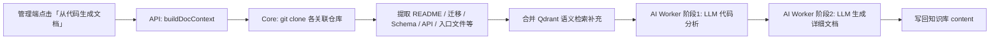

# Knowledge base management optimization
_Exported on 7/6/2026 at 16:58:08 GMT+8 from Cursor (3.10.11)_

---

**User**

现在的管理端 知识库管理。从代码生成文档，帮我优化一下：
1.  底层需要去下载git对应的代码，llm分析具体的内容。
2. 调用llm生成代码的具体文档
包括：
- 系统简介
- 系统功能
- 系统架构设计
- 表设计
- 对外提供服务
- 具体业务信息
这个要生成的比较详细

---

**Cursor**

先定位管理端「知识库 → 从代码生成文档」的现有实现与调用链，再据此设计下载 Git 代码与 LLM 生成详细文档的优化方案。


开始实现：在 Core 增加 Git 克隆与代码上下文提取，并增强 LLM 文档生成流程。


已优化管理端「从代码生成文档」的完整链路，核心变化如下。

## 变更摘要

### 修改了哪些文件

| 文件 | 说明 |
|------|------|
| `services/core/internal/application/doc_context_service.go` | 新增：Git clone + 目录树 + 关键文件提取 |
| `services/core/internal/interfaces/http/internal_handlers.go` | 新增 `POST /internal/repos/doc-context` |
| `services/api/src/infrastructure/clients/core-http.client.ts` | 新增 `buildDocContext` 客户端 |
| `services/api/src/application/knowledge/knowledge.use-cases.ts` | 生成文档时先拉取代码上下文，再补充语义检索 |
| `services/ai-worker/chains/doc_gen.py` | 两阶段 LLM：代码分析 → 详细文档生成 |
| `apps/admin/src/components/panels/KnowledgePanel.tsx` | 成功提示文案更新 |
| 测试文件 × 3 | Go / Python / TS 单元测试 |

### 改了什么行为

**之前**：只做一次向量检索，用简单 4 段 prompt 生成文档。

**现在**：



生成的文档固定包含 6 个详细章节：
1. **系统简介**
2. **系统功能**
3. **系统架构设计**
4. **表设计**
5. **对外提供服务**
6. **具体业务信息**

Core 会从 Git 仓库提取：目录结构、README、manifest（`go.mod`/`package.json` 等）、迁移/SQL、GraphQL/Schema、API 路由、入口源码等（单仓库最多 32 个文件，带截断保护）。

### 为什么这样改

- **Git clone** 放在 Core 层，复用已有 `git.Client`，与索引流水线一致
- **两阶段 LLM**：先结构化分析代码，再写正式文档，比单次 prompt 更稳定、更详细
- **语义检索作为补充**，不替代真实代码内容

### 做了哪些验证

- [x] Go 单元测试：`go test ./internal/application/...` — 通过
- [x] Python 单元测试：`tests/test_doc_gen.py` — 4 passed
- [x] API 单元测试：`knowledge.use-cases.test.ts` — 3 passed

### 有哪些假设

- Core 服务已启动，且 `GIT_WORK_DIR` 可写、`git` 命令可用
- 关联仓库的 Git URL 可访问（私有仓需已配置 Token）
- AI Worker 已配置 `LLM_SCENE_DOC_GEN_MODEL` 对应 API Key，否则走 Placeholder 草稿

### 还剩哪些风险或未验证项

- 大型仓库 clone 可能较慢（当前为 `--depth 1` 浅克隆，已做文件数/字符数上限）
- 未做端到端联调（需本地启动 Core + API + AI Worker）
- 私有 Git 鉴权依赖仓库 `authConfig` 是否已写入 clone URL（若现有索引能 clone，文档生成也应能工作）

---

**使用方式**：管理端 → 知识库管理 → 编辑文档 → 关联 Git 仓库 → 点击「从代码生成文档」。配置好 LLM 后，会基于真实代码生成上述 6 个章节的详细 Markdown 文档。

如需继续优化，可以考虑：生成进度 SSE 展示、按 `docType` 定制章节模板、或支持指定分支/路径范围分析。

---

**User**

对于用户想要生成培训文档、设计文档、运维文档，需要给ai设置对应的角色，告诉ai生成相关的内容。不要全部生成一样的内容。要设计对应的提示词，role，背景信息提供给llm

---

**Cursor**

按文档类型（培训、设计、运维等）拆分 LLM 的角色、背景与提示词，避免各类文档生成相同内容。


为各文档类型定义独立的角色、背景、分析重点与章节结构。


已为各文档类型配置独立的 **角色（role）**、**背景**、**分析重点** 与 **章节结构**，LLM 通过 System Message 注入角色，不再全部生成相同内容。

## 变更摘要

### 修改了哪些文件
- `services/ai-worker/chains/doc_gen.py` — 核心：按 `docType` 分角色/提示词/章节
- `services/ai-worker/tests/test_doc_gen.py` — 覆盖各类型差异
- `services/api/src/infrastructure/clients/ai-worker-doc.client.ts` — Mock 也按类型输出不同章节

### 各文档类型的角色设计

| 类型 | AI 角色 | 目标读者 | 章节侧重 |
|------|---------|----------|----------|
| **设计文档** `design` | 资深系统架构师 | 技术负责人、研发 | 系统简介、架构设计、表设计、对外服务… |
| **培训文档** `training` | 企业技术培训讲师 | 新员工 | 学习路径、环境启动、实操指南、代码导读、FAQ |
| **运维文档** `ops` | 资深 SRE / DevOps | 运维、值班 | 部署拓扑、配置密钥、监控告警、发布回滚、应急预案 |
| **ADR** `adr` | 技术委员会架构师 | 架构师 | 背景问题、方案对比、决策理由、风险跟进 |
| **其他** `other` | 技术文档工程师 | 全体研发 | 目的范围、核心概念、模块说明 |

### 技术实现

两阶段 LLM 调用均注入 System Message：

```
System: 你是{角色}。背景、目标读者、写作风格
Human:  按该类型的分析重点 / 章节指引生成内容
```

- **阶段 1（代码分析）**：同一仓库，培训文档侧重「环境搭建、上手路径」；运维文档侧重「部署、配置、监控」
- **阶段 2（文档撰写）**：章节标题与指引完全按 `docType` 配置，并明确要求「不要生成与其他类型无关的章节」

### 验证
- `tests/test_doc_gen.py` — 7 passed（含培训/运维/设计章节差异断言）

管理端选择不同「类型」后点击「从代码生成文档」，会按对应角色与模板生成内容。若需为某类型微调章节或语气，直接改 `DOC_TYPE_PROFILES` 中对应配置即可。

---

**User**


http://localhost:4000/graphql
{
    "query": "\n        mutation($id: ID!) {\n          generateKnowledgeDocContent(id: $id) { id content }\n        }\n      ",
    "variables": {
        "id": "e41aac83-bfb8-4712-a87a-25582ac53ef4"
    }
}
一直没有返回，排查下。

点击从代码生成，需要弹出页面，展示进度
eg:正在拉取代码
正在思考
正在生成
生成的内容要滚动显示。
生成完后，内容填充到文档内容中。

---

**Cursor**

先排查 `generateKnowledgeDocContent` 无响应的原因，再实现带进度与流式展示的生成弹窗。


实现 SSE 流式生成与进度弹窗，解决 GraphQL 同步调用长时间无响应的问题。


## 问题原因

`generateKnowledgeDocContent` 是**同步 GraphQL Mutation**，整条链路要依次完成：

1. Core **git clone** 拉取代码（可能几十秒～数分钟）
2. AI Worker **两阶段 LLM**（分析 + 生成，也可能很久）

期间 HTTP 连接一直挂着、前端没有任何反馈，看起来像「一直没有返回」。

---

## 解决方案

改为 **SSE 流式生成**，并增加进度弹窗。

### 后端

- 新接口：`POST /api/knowledge/doc/generate/stream`
- SSE 事件阶段：
  - `fetching_code` → 正在拉取代码
  - `analyzing` → 正在思考
  - `generating` → 正在生成（`token` 事件逐段输出）
  - `done` → 完成并自动保存到数据库

### 前端

点击「从代码生成文档」后弹出进度 Modal：
- Steps 显示三阶段进度
- 下方预览区**滚动显示**实时生成内容
- 完成后自动填入「文档内容」编辑框

---

## 使用注意

请确认以下服务都在运行（改动后需重启）：

```bash
# Core（git clone）
cd services/core && go run ./cmd/server

# AI Worker（LLM 流式）
cd services/ai-worker && source .venv/bin/activate && lingprism-ai-http

# API
cd services/api && npm run dev

# Admin
cd apps/admin && npm run dev
```

若仍卡住，优先检查：
- Core 是否可达（`buildDocContext` / git clone）
- AI Worker 是否启动（`localhost:8001`）
- LLM API Key 是否配置（`ZHIPU_API_KEY` 等）

原来的 GraphQL Mutation 仍保留，但管理端已改为走流式接口，不会再长时间无响应。

---

**User**

commit & push

---

**Cursor**

正在提交知识库文档流式生成相关改动；`qa_router`/`rag_retrieval` 与已暂存的 chat 文档不在本次提交范围内。


已提交并推送到 `origin/main`。

**Commit:** `3979777`  
**Message:** Add streaming knowledge doc generation from git code with role-based LLM prompts.

**本次包含（24 个文件）：**
- Core：Git 代码上下文提取（`doc-context` API）
- API：SSE 流式生成接口 `/api/knowledge/doc/generate/stream`
- AI Worker：按文档类型分角色的 LLM 提示词 + 流式生成
- Admin：进度弹窗（拉取代码 / 思考 / 生成）+ 内容滚动预览
- 相关单元测试

**未纳入本次提交（仍为本地改动）：**
- `services/ai-worker/chains/qa_router.py`
- `services/ai-worker/chains/rag_retrieval.py`
- 对应测试文件

如需一并提交 RAG 相关改动，告诉我即可。

