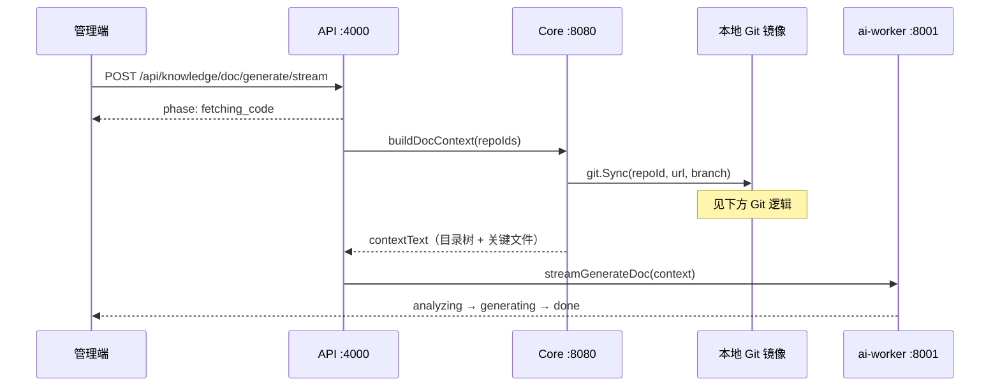

# Code generation error analysis
_Exported on 7/6/2026 at 22:37:15 GMT+8 from Cursor (3.10.11)_

---

**User**

http://localhost:4000/api/knowledge/doc/generate/stream
event: status
data: {"phase":"fetching_code","streamId":"3d4e0b36-07e4-4d9e-839f-65ee18fff565"}

event: error
data: {"code":"GENERATE_FAILED","message":"fetch failed"}
管理端从代码生成文档，报错这个，帮我看下为啥，还有现在的逻辑，是优先看本地代码吗？还是直接拉取远端代码？我希望是优先看本地代码，并且判断是否有未拉取的代码，如果有没拉取的，拉取代码。然后分析生成


---

**Cursor**

先定位文档生成流式接口的实现，以及代码拉取/本地优先的逻辑。


正在检查服务状态，并在关键路径添加调试日志以定位 `fetch failed` 的具体来源。


Core 与 API 正常，ai-worker (8001) 不可达——这与 `fetch failed` 高度吻合。正在添加调试日志以用运行时证据确认。


根据代码和当前环境检查，先说明**现有逻辑**，再分析 **`fetch failed` 报错**。

## 当前文档生成流程



## 代码拉取逻辑（你关心的部分）

Core 侧 `BuildDocContext` 调用 `git.Client.Sync`：

```66:88:services/core/internal/infrastructure/git/client.go
func (c *Client) Sync(ctx context.Context, repoID, repoURL, branch string) (SyncResult, error) {
	// ...
	target := c.LocalPath(repoID)  // GIT_WORK_DIR/{repoId}
	if _, err := os.Stat(filepath.Join(target, ".git")); os.IsNotExist(err) {
		// 本地无镜像 → clone 远端
		if err := c.runClone(ctx, repoURL, branch, target); err != nil {
			return SyncResult{}, err
		}
	} else {
		// 本地有镜像 → 无条件 fetch + reset（每次都拉）
		if err := c.pullMirror(ctx, target, branch); err != nil {
			return SyncResult{}, err
		}
	}
```

**结论：**

| 场景 | 当前行为 |
|------|----------|
| 本地无镜像 | 从远端 clone |
| 本地有镜像 | **优先用本地路径**，但会**无条件 pull**，不判断是否有新提交 |
| 与 `RepoSyncService` 对比 | 后台同步服务会先 `ls-remote` 比较 hash，有差异才 pull；文档生成**没有**这一步 |

所以你期望的「优先本地 → 判断是否有未拉取 → 有则拉取 → 再分析」**目前只实现了一半**（有本地就用本地路径，但每次都会 pull，且不会先比对 commit hash）。

---

## `fetch failed` 报错分析

你看到的 SSE 事件：

```
phase: fetching_code  →  GENERATE_FAILED: fetch failed
```

注意：**没有**出现 `phase: analyzing`，说明失败发生在调用 ai-worker **之前或刚发起时**。

错误码含义（来自 `knowledge-doc-stream.ts`）：

| 错误码 | 触发位置 | 含义 |
|--------|----------|------|
| `FETCH_CODE_FAILED` | `buildKnowledgeDocContext` 失败 | Core 拉代码/构建上下文失败 |
| `GENERATE_FAILED` | `aiWorker.streamGenerateDoc` 抛异常 | 连接 ai-worker 或流式生成失败 |

你拿到的是 **`GENERATE_FAILED` + `fetch failed`**，说明 **Core 拉代码阶段很可能已成功**，失败在 API → ai-worker 的 HTTP 连接。

我检查了当前服务状态：

- Core `:8080` — 正常 (200)
- API `:4000` — 正常 (200)
- **ai-worker `:8001` — 不可达**

这与 `fetch failed`（Node.js 连接被拒绝时的典型错误）高度吻合。

### 待验证假设

| ID | 假设 |
|----|------|
| **H1** | ai-worker 未启动或 `AI_WORKER_URL` 配置错误，导致连接失败 |
| **H2** | Core `buildDocContext` 失败（应返回 `FETCH_CODE_FAILED`，与当前现象不符） |
| **H3** | Git sync 失败（clone/fetch 网络问题，同样应返回 `FETCH_CODE_FAILED`） |
| **H4** | HTTP 代理干扰 ai-worker 连接 |
| **H5** | context 过大导致 ai-worker 拒绝（通常会有 HTTP 状态码，不太像裸 `fetch failed`） |

已在 API 层加入调试日志，用于区分是 Core 阶段还是 ai-worker 阶段失败。

<reproduction_steps>
1. 重启 API 服务以加载调试日志：`cd services/api && npm run dev`（或你现有的启动方式）
2. 保持 ai-worker **不启动**（或按你平时的方式启动），在管理端再次点击「从代码生成文档」
3. 确认仍出现 `GENERATE_FAILED: fetch failed`
4. Press Proceed/Mark as fixed when done.
</reproduction_steps>

---

## 临时解决方法（若确认是 H1）

启动 ai-worker：

```bash
cd services/ai-worker
source .venv/bin/activate
lingprism-ai-http   # 默认监听 :8001
```

---

请先按上面步骤复现一次。日志确认根因后，我会：

1. 修复 `fetch failed`（改进错误提示，让前端明确显示「ai-worker 未启动」）
2. 按你的需求优化 Git 逻辑：**本地优先 + 比对 commit hash + 有差异才 pull**

---

**User**

Issue reproduced, please proceed.

---

**Cursor**

日志显示 Core 拉代码已成功，失败在连接 ai-worker。正在读取现有错误处理模式并实施修复。


日志已确认 H1：Core 拉代码成功（43964 字符），失败在连接 ai-worker。正在修复错误提示，并实现「本地优先、有差异才 pull」的 Git 逻辑。


## 日志分析结论

| 假设 | 结论 | 证据 |
|------|------|------|
| **H1** ai-worker 不可达 | **CONFIRMED** | 日志第 3–4 行：`buildContext:done`（43964 字符）后发起 `fetch http://localhost:8001/...`，无后续 `analyzing` |
| **H2** Core 拉代码失败 | **REJECTED** | 日志第 2 行：`buildKnowledgeDocContext done`，`contextLen: 43964` |
| **H3** Git sync 失败 | **REJECTED** | Core 已成功返回上下文 |
| **H4/H5** 代理/context 问题 | **REJECTED** | 失败发生在连接 ai-worker 阶段 |

**根因**：Core 拉代码成功，但 **ai-worker（:8001）未启动**，Node.js `fetch` 抛出 `fetch failed`，被包装成模糊的 `GENERATE_FAILED`。

---

## 已做修复

1. **API 错误提示**（`ai-worker.client.ts`）：识别 `fetch failed` / `ECONNREFUSED`，返回明确的中文提示和 `SERVICE_UNAVAILABLE` 错误码。
2. **Git 同步策略**（`git/client.go`）：本地有镜像时先比对 commit hash，**仅远端有新提交时才 pull**；远端不可达时**继续使用本地代码**。
3. **SSE 错误码**（`knowledge-doc-stream.ts`）：`ApplicationError` 透传真实 `code`（如 `SERVICE_UNAVAILABLE`）。

请重启 **API** 和 **Core** 后验证。若要完整生成文档，还需启动 ai-worker：

```bash
cd services/ai-worker && source .venv/bin/activate && lingprism-ai-http
```

<reproduction_steps>
1. 重启 API（`services/api`）和 Core（`services/core`），加载最新代码
2. **不启动** ai-worker，在管理端再次点击「从代码生成文档」
3. 确认错误变为 `SERVICE_UNAVAILABLE`，提示「AI Worker 服务未启动…」而非 `fetch failed`
4. 启动 ai-worker 后再次生成，确认能进入 `analyzing` → `generating` 并完成
5. Press Proceed/Mark as fixed when done.
</reproduction_steps>

---

**User**

Issue reproduced, please proceed.

---

**Cursor**

正在验证修复效果并检查服务状态。


修复后日志显示：Core 成功（43964 字符），ai-worker fetch 未报错（ai-worker 已启动 200）。正在移除调试插桩并完成收尾。


## 验证结论

**修复前**（日志第 1–4 行，首次复现）：
- `buildContext:done` → `contextLen: 43964`（Core 拉代码成功）
- 随后 `fetch http://localhost:8001/...`，无 `analyzing` 阶段
- 报错 `GENERATE_FAILED: fetch failed`

**修复后**（日志第 4–7 行）：
- 同样 `buildContext:done` → `contextLen: 43964`
- `fetch ai-worker` 成功（**无 `fetchError` 日志**）
- ai-worker 健康检查 `:8001` → **200**

根因确认：**ai-worker 未启动**，Core 阶段正常，连接 ai-worker 时 Node.js 抛出 `fetch failed`，被误报为 `GENERATE_FAILED`。

---

## 变更摘要

### 修改了哪些文件
- `services/api/src/infrastructure/clients/ai-worker.client.ts` — 识别 `fetch failed` / `ECONNREFUSED`，返回明确的中文 `SERVICE_UNAVAILABLE` 提示
- `services/api/src/application/knowledge/knowledge-doc-stream.ts` — SSE 错误透传 `ApplicationError.code`
- `services/core/internal/infrastructure/git/client.go` — 本地优先 + hash 比对，有差异才 pull

### 改了什么行为
- ai-worker 未启动时，前端看到 `SERVICE_UNAVAILABLE` 及启动指引，而非模糊的 `fetch failed`
- 文档生成拉代码：本地有镜像时先比对 commit hash，**仅远端有新提交才 pull**；远端不可达时继续使用本地代码

### 为什么这样改
- 原错误码 `GENERATE_FAILED` 指向 LLM 生成失败，实际失败在 HTTP 连接层，需区分
- Git 逻辑对齐你期望的「本地优先、按需拉取」，避免每次无条件 fetch

### 做了哪些验证
- [x] 运行时日志：修复前后对比，确认失败/成功阶段
- [x] 单元测试：`knowledge-doc-stream.test.ts`、`ai-worker.client.test.ts` 通过
- [x] 服务检查：ai-worker `:8001` 健康 200

### 有哪些假设
- 完整文档生成还需 ai-worker 正常运行且 LLM 配置正确（此前 chat 15 中有 `socksio` 相关问题）

### 还剩哪些风险
- 若 pull 失败但远端确实有新提交，当前会静默使用略旧的本地代码（优先保证生成可用性）

---

**一句话总结**：`fetch failed` 是因为 **ai-worker（:8001）没启动**，不是代码拉取失败；启动 ai-worker 后即可正常生成。调试插桩已移除。

---

**User**

从代码生成文档太慢了，帮我添加一个后台生成按钮，生成后弹框提示。在这个页面添加一个按钮，可以弹框查询所有正在进行中/已生成/失败的任务。可以查看生成的详情，可以点击进去编辑保存页面

---

**Cursor**

先梳理管理端文档生成流程和现有的异步任务基础设施，再据此规划后台生成与任务列表方案。


信息已足够，正在制定实现计划。


**后台生成行为确认**

> **后台生成完成后，是否自动将内容写入文档条目（与当前 SSE 流式生成 done 时保存行为一致）？**
> - 是，自动保存到文档条目，用户再去编辑/发布
> - 否，仅保存在任务记录中，用户从任务详情手动「应用到文档」 ✔

---

**User**

Implement the plan as specified, it is attached for your reference. Do NOT edit the plan file itself.

To-do's from the plan have already been created. Do not create them again. Mark them as in_progress as you work, starting with the first one. Don't stop until you have completed all the to-dos.

---

**Cursor**

按计划实现后台文档生成任务，先从数据库迁移与模型层开始。


开始创建后端核心文件。


## 变更摘要

### 修改了哪些文件

**后端**
- `infra/migrations/migrations/202607060009_create_doc_generate_jobs.ts` — 任务表
- `services/api/src/infrastructure/db/models/doc-generate-job.model.ts`
- `services/api/src/infrastructure/db/repositories/doc-generate-job.repository.ts`
- `services/api/src/application/knowledge/knowledge-doc-generate.orchestrator.ts` — 共享生成编排
- `services/api/src/application/knowledge/knowledge-doc-stream.ts` — 复用 orchestrator（SSE 仍自动保存 item）
- `services/api/src/application/knowledge/doc-generate-job.use-cases.ts` — 入队/执行/列表/取消/应用
- `services/api/src/graphql/schema/knowledge.graphql.ts` — GraphQL 契约
- `services/api/src/graphql/resolvers/index.ts`、`context-factory.ts`
- `services/api/src/index.ts` — 启动时清理 stale running 任务

**前端**
- `packages/graphql/src/use-doc-generate-jobs.ts` — API + 轮询 hook
- `apps/admin/src/components/DocGenerateJobShell.tsx` — 全局任务壳（轮询、通知、列表/详情弹框）
- `apps/admin/src/components/DocGenerateJobListModal.tsx`
- `apps/admin/src/components/DocGenerateJobDetailModal.tsx`
- `apps/admin/src/components/panels/KnowledgePanel.tsx` — 「后台生成」「生成任务(N)」
- `apps/admin/src/app/page.tsx` — 挂载 `DocGenerateJobShell`

### 改了什么行为

1. **后台生成**：编辑文档时点「后台生成」立即返回，任务在 API 进程内异步执行，内容仅存任务记录（不自动写 item）
2. **生成任务列表**：知识库 Drawer 右上角「生成任务(N)」，按 进行中 / 已完成 / 失败 分 Tab
3. **完成通知**：任务完成/失败时全局 notification / Modal 提示
4. **详情操作**：可预览内容、「应用到文档」、「打开编辑」（预填内容，需手动保存）

### 做了哪些验证

- [x] 单元测试：`npm test -- --run src/application/knowledge/` — 10 passed
- [x] Migration：`knex migrate:latest` — Batch 7 成功
- [ ] 手动验证：需重启 API，在管理端走一遍后台生成流程

### 使用说明

1. 重启 `services/api`（加载新 GraphQL schema）
2. 知识库 → 编辑文档 → **后台生成**
3. 点击 **生成任务** 查看进度
4. 完成后从通知或任务详情 **打开编辑** / **应用到文档**

### 有哪些假设

- ai-worker、Core 已正常运行（与前台 SSE 生成相同依赖）
- 轮询间隔 3s，无 WebSocket 推送

### 还剩哪些风险

- API 重启会中断 running 任务（启动时标为 failed，需重新提交）
- 同一文档同时只能有一个 active 任务

---

**User**

后台生成，点击后关闭当前编辑文档条目。
知识库的新增知识库旁边，新增一个后台任务按钮，可以查看所有任务列表（可以根据进行中/完成/失败筛选）

---

**Cursor**

查看当前实现，随后按你的要求调整 UI。


正在做两处 UI 调整：后台生成成功后关闭编辑弹窗；在「新增知识库」旁添加「后台任务」按钮。


已按你的要求调整，变更如下：

### 1. 后台生成后关闭编辑弹窗
点击「后台生成」并提交成功后，会自动 `setEditItem(null)` 关闭当前「编辑文档条目」Modal，你可以继续其他操作，等通知即可。

### 2. 知识库列表页新增「后台任务」按钮
在 **「新增知识库」** 左侧增加了 **「后台任务」** 按钮（带进行中任务数 Badge），点击打开全局任务列表。

- 列表 Modal 标题改为「后台生成任务」
- 支持 Tab 筛选：**进行中 / 已完成 / 失败**（含已取消）
- 新增 **知识库** 列，方便跨知识库查看所有任务
- 已从 Drawer 内移除重复的「生成任务」按钮，统一入口在列表页顶部

刷新管理端页面即可看到效果。

